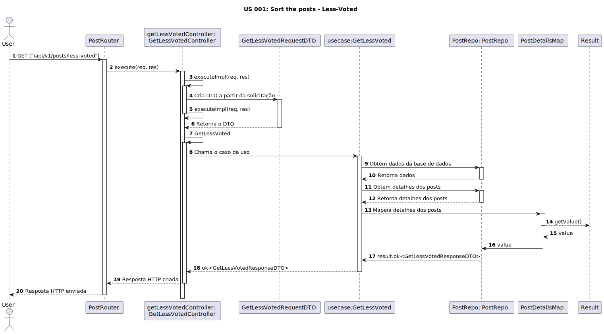

# US 001 - Sort the posts new functionality less-voted

## 1. Requirements Engineering

### 1.1. User Story Description

As a user, I want to be able to sort the posts, so that I can discover the most popular, less-voted or new posts.

### 1.2. Customer Specifications and Clarifications

**From the specifications document:**

> **Question:** How will the posts be sorted in the user interface?

> **Answer:** 
>  The posts will be sorted in popular, less-voted or new posts.

> **Question:** 
>  If there are posts with the same number of votes, how will they be sorted?
>
> **Answer:**
>  They will be sorted by the order of publication, with the most recent appearing first.

> **Question:**
>  If the user is not logged in, will he be able to see the sorted posts?
>
> **Answer:**
>  Yes, he will be able to see the sorted posts, but he will not be able to vote.

### 1.3. Acceptance Criteria

* **AC1:** The user posts must be automatically sorted in ascending order based on the number of votes, starting with the posts with the lowest number of votes.
* **AC2:** The user must be able to see the number of votes of each post.
* **AC3:** Posts with the same number of votes must be sorted by the order of publication, with the most recent appearing first.

### 1.4. Found out Dependencies

- There are dependencies for "US 002: Create an account" - "US 010: Log in" because the user needs to be authenticated and logged in to access. "US 003: Creat a post" there must be posts in order to be ranked. 

### 1.5 Input and Output Data

**Input Data:**

	
* Selected data:
	* Sort option: Popular, Low-vote posts or New, from the user interface.

**Output Data:**

* List of posts, sorted based on the selected option (Popular, Low-vote Posts or New).

### 1.6. System Sequence Diagram (SSD)

### 1.7 Other Relevant Remarks

* By default, the main page appears based on the sorting option "Popular".

### 1.8 Bugs

#### **Bug #1**: Incorrect post sorting. (AC2) (only back-end)

##### **Description:**

In backend test environment, the posts are not sorted correctly when sorting by new is selected.

##### **Approach:**

Investigate and debug the code responsible for post sorting.
Validations should be done in the back-end and the front-end.

| Acceptance Criteria | Front-End | Back-End |
| -------- | -------- | -------- |
| AC1 | No bugs found | No bugs found |
| AC2 | No bugs found | Bug found - incorrect sorting in backend testing |

##### **Fixed bugs:**

#### **Bug #1**: Incorrect post sorting. (AC2) (only back-end)

**Back-end:** The sorting was being done by the primary key of the post, instead of the creation date. The validation was corrected and the sorting is now done by the creation date.

[Link to the commit](https://github.com/Departamento-de-Engenharia-Informatica/switch-qa-23-project-switch-qa-23-4/commit/7cb425140ada8f3f9293f6ed65d0884b51fd2840)

**Bug fix date:** 2023/10/06 [Link to the commit](https://github.com/Departamento-de-Engenharia-Informatica/switch-qa-23-project-switch-qa-23-4-elainne/commit/7cb425140ada8f3f9293f6ed65d0884b51fd2840)
=======

### 1.9. Sequence Diagram

