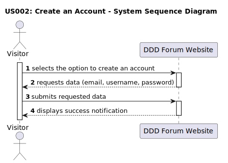

# US 002 - Create an account

## 1. Requirements Engineering

### 1.1. User Story Description

As a visitor, I want to register on the forum website.

### 1.2. Customer Specifications and Clarifications 

**From the specifications document:**

> The system allows the visitors to create an account in the forum website. The account creation requires a username, email and password.

**From the client clarifications:**

> **Question:** 
> Will the visitor be able to create more than one account?
>
> **Answer:** 
> Yes, the visitor will be able to create more than one account but the email address and username must be unique.

> **Question:** 
> What is the mandatory information for a visitor to create an account?
>
> **Answer:** 
> The mandatory information for a visitor to create an account is the email address, username and password.

> **Question:**
> Will the visitor need a second step to validate the account creation?
>
> **Answer:** 
> No, the visitor will not need a second step to validate the account creation. The visitor will be directed to the homepage after the validation of the account creation.

### 1.3. Acceptance Criteria

* **AC1:** All requested data (email address, username and password) must be filled in.
* **AC2:** An email must have an email format (local part + @ symbol + domain.).
* **AC3:** An username must have at least two characters.
* **AC4:** The email address must be unique.
* **AC5:** The username must be unique.
* **AC6:** A password must have at least six characters.
* **AC7:** When the submitted data is invalid, insuccess notifications must be displayed.
* **AC8:** When the submitted data is valid, success notifications must be displayed.

### 1.4. Found out Dependencies

There are no dependencies for this user story.

### 1.5 Input and Output Data

**Input Data:**

* Typed data:
	* an email, 
	* an username,
	* a password

**Output Data:**

* Successful Registration:
Confirmation green pop-up notifications "You're all signed up! Logging you in.(cowboyhatface)" and " Logged in! (cowboyhatface)"
* Invalid Input of the Username:
Output: Red pop-up notification "Yeahhhhh, TypeError: Cannot read property 'toString' of undefined (cowboyhatface)"
* Empty Input of the Username:
Output: Red pop-up notification "Yeahhhhh, you forgot your username. (cowboyhatface)"
* Input of an Existing Username:
Output: Red pop-up notification  "Yeahhhhh, The "input  username" username was already taken (cowboyhatface)".
* Invalid Input of the Email:
Output: Red pop-up notification "Yeahhhhh, Want to try that again with a valid email? (cowboyhatface)"
* Input of an Existing Email:
Output: Red pop-up notification "Yeahhhhh, The email "local part @ symbol + domain " associated for this account already exists (cowboyhatface)".
* Invalid Input of the Password:
Output: Red pop-up notification "Yeahhhhh, your password should be at least 6 chars (cowboyhatface)"

### 1.6. System Sequence Diagram (SSD)

### 1.7 Other Relevant Remarks

* This user story was important to document but was not included in the use case diagram. It is not a core feature of the forum website.
