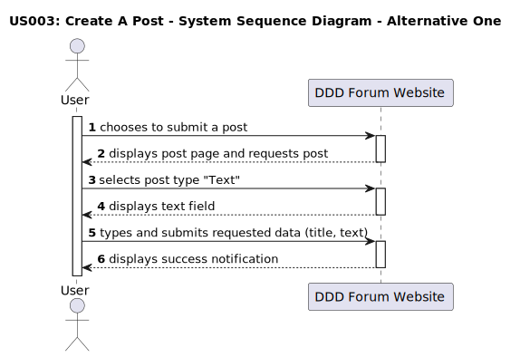
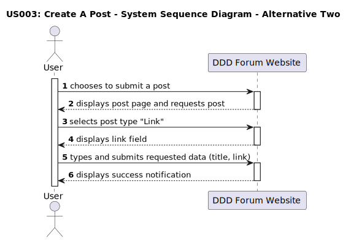

# US 003 - Create a post

## 1. Requirements Engineering

### 1.1. User Story Description

 
As a user, I want to submit posts. 

### 1.2. Customer Specifications and Clarifications 

**From the specifications document:**

> The ability to create a post is exclusive to the users of the forum.

> The users must have an account and be logged in.

**From the client clarifications:**

> **Question:** 
>  What is necessary to create a post?
>
> **Answer:** 
>  The visitor must be a user of the DDD Forum website and be authenticated in order to create a post.

> **Question:** 
>  Which kind of posts can be created?
>
> **Answer:** 
>  The user can create text or link posts.

> **Question:**
>  Who can see the posts created by the user?
>
> **Answer:**
>  All visitors can see the posts created by the user.

> **Question:**
> Can the user edit the post text after submitting it?
>
> **Answer:**
> No, the user can't edit the post text after submitting it.

> **Question:**
> What are the options to format the text of a text post?
>
> **Answer:**
> The user can format the text of a text post using bold, italic, underline, hyperlink and code formatting.

### 1.3. Acceptance Criteria

* **AC1:** The user must be authenticated to create a post.
* **AC2:** All requested data (title and text/link) must be filled in.
* **AC3:** The title must have between 2 and 85 characters. 
* **AC4:** A text post type must have between 20 and 10000 characters. 
* **AC5:** For a text post type, text formatting options must be available and accessible (bold, italic, underline, hyperlink and code formatting).
* **AC6:** A link post type must have between 8 and 500 characters. 
* **AC7:** When the submitted data is valid, success notifications must be displayed.
* **AC8:** When the submitted data is invalid, insuccess notifications must be displayed.
* **AC9:** The post must have zero votes applied by default.

### 1.4. Found out Dependencies

* There is a dependency to "US010: Perform a login", because it is necessary to be authenticated in order to create a post.

### 1.5 Input and Output Data

**Input Data:**

* Typed data:
	* post (title, text) - for text post type;
	* post (title, link) - for link post type.
>	
* Selected data:
	* classifying post type;
	* text formatting (only for text post type).

**Output Data:**

* Successful post submission:
	* green pop-up notification: "Done-zo! (cowboyhatface)";
>
* Insuccessful post submission:
	* Invalid title:
		* red pop-up notification: "Yeahhhhh, title should be 2 to 85 characters. Yours was "X". (cowboyhatface)".
	* Invalid text:
		* red pop-up notification: "Yeahhhhh, text posts should be 20 to 10000 characters. Yours was "X". (cowboyhatface)".
	* Invalid link:
		* red pop-up notification: "Yeahhhhh, link posts should be 8 to 500 characters. Yours was "X". (cowboyhatface)"; 
	* Both invalid title and text/link:
		* red pop-up notification: "Yeahhhhh, title  should be 2 to 85 characters. Yours was "X". (cowboyhatface)".

### 1.6. System Sequence Diagram (SSD)

#### Alternative One

#### Alternative Two

### 1.7 Other Relevant Remarks

* When the post submission is successful, the number of success notifications is not always the same (varies between 1 and 2).
* The characters counting of the text/link input box is not always right, making it possible to submit posts with invalid number of characters.
* On a link post, besides the link, it is not possible to have text on the input box.
* In case of both invalid title and text/link, the error notification only guides the user about the invalid title.

### 1.8. Bugs

#### **Bug #1**: Incorrect counting of characters. - AC4 (front-end and back-end)

##### **Description:**

The characters counting of the post text is not always right. It is possible to submit a text post with less than 20 characters (front-end and back-end).
On the other hand, it is not possible to create a post with 10 000 characters (front-end).

##### **Approach:**

Investigate and debug the code responsible for character counting.
Validations should be done in the back-end and the front-end.

#### **Bug #2**: Code formatting affects the whole line. - AC5 (front-end)

##### **Description:**

The code formatting option applies to the entire post text, instead of just the selected text.

##### **Approach:**

Investigate and debug the code responsible for text formatting.
Validations should be done in the front-end.

#### **Bug #3**: Incorrect counting of characters and a valid TDL required. - AC6 (front-end and back-end)

##### **Description:**

The characters counting is always 0 if the link we want to submit doesn`t have a valid TLD.
It is possible to post a link with 8 characters, but only if it has a valid TLD (front-end).
It is possible to post a link with only 4 characters, if it has a valid TLD (back-end).
It is not possible to submit a link with more than 67 characters, even with a valid TLD (front-end and back-end).

##### **Approach:**

Investigate and debug the code responsible for caracters counting and TLD validation.
Validations should be done in the front-end and the back-end.

#### **Bug #4**: Votes incorrectly applied on new posts - AC9 (front-end and back-end)

##### **Description:**

When a new post is created, it is create with initial upvote from whomever created the post.

##### **Approach:**

Investigate and debug the code responsible for the submission of new posts.
This bug will be treated in US004 - Vote on a post.

##### **Summary:**

| Acceptance Criteria | Front-End | Back-End |
| -------- | -------- | -------- |
| AC1 | No bugs found | Same behaviour from frontend |
| AC2 | No bugs found | Same behaviour from frontend |
| AC3 | No bugs found | Same behaviour from frontend |
| AC4 | Minimum limit: Text posts with only 13 characters are accepted; Maximum limit: Text posts with more than 9993 characters are not accepted. **[Bugs #1]**| Minimum limit: Text posts with only 2 characters are accepted. Maximum limit: Working as intended. **[Bugs #1]**|
| AC5 | It is possible to format specific words without affecting the whole line, except with code formatt, that applies the format to the whole line. **[Bugs #2]**| It is possible to format specific words, with all formatting types, without affecting the whole line.|
| AC6 | Minimum limit: Link posts with 8 characters are accepted, only if they have a valid TLD; Maximum limit: Link posts with more than 67 characters are not accepted, even if they have a valid TLD. **[Bugs #3]**| Minimum limit: Link posts with only 4 characters are accepted, if they have a valid TLD; Maximum limit: Same behaviour from frontend **[Bugs #3]**|
| AC7 | No bugs found | Same behaviour from frontend |
| AC8 | No bugs found | Same behaviour from frontend |
| AC9 | An upvote is applied for new posts **[Bugs #4]** | Same behaviour from front-end  |
  
#### Note: 
* TLD - Top-Level Domain.  
(\public\app\src\shared\utils\TextUtil.tsx:  
The psl.get method is used to get the top-level domain name (TLD) of the hostname variable.)

##### **Fixed bugs:**

* **Bug #1:** Incorrect counting of characters. - AC4 (front-end and back-end)

**Back-end:** The validation was set to 2 characters instead of 20. The validation was corrected.

[Link to the commit](https://github.com/Departamento-de-Engenharia-Informatica/switch-qa-23-project-switch-qa-23-4/commit/87cc85531cf415a697f54b5f42a26226725f45b8)

**Front-end:** After debug, it was found that the validation was being done in the back-end.
In the front-end the character counting of the text post was taking into account the html tags, which were being counted as characters. The validation was corrected.

[Link to the commit](https://github.com/Departamento-de-Engenharia-Informatica/switch-qa-23-project-switch-qa-23-4/commit/328e5d19db5a88d184d1976466c1280366f4620b)

* **Bug #2:** Code formatting affects the whole line. - AC5 (front-end)

**Front-end:** After debug, it was found that the validation was being done in the back-end.
In the front-end the code formatting option was being applied to the entire line of text, instead of just the selected words. The block format that affected all text was changed to another format that only affects selected words. The validation was corrected.

[Link to the commit](https://github.com/Departamento-de-Engenharia-Informatica/switch-qa-23-project-switch-qa-23-4/commit/7de60e1b9f0f0045f2017d2acb549024901fbbfa)

* **Bug #3:** Incorrect counting of charactersIncorrect counting of characters and a valid TDL required. - AC4 (back-end)

**Back-end (parcial fix):** The validation was set to minimum 8 characters and maximum 500. The validation for the minimum value was corrected.

[Link to the commit](https://github.com/Departamento-de-Engenharia-Informatica/switch-qa-23-project-switch-qa-23-4/commit/7f17e8f977bb3d32a499c7a412eefe76cffed307)

* **Bug #4:** Votes incorrectly applied on new posts - AC9 (back-end)

There was code in the back-end applying an upvote to the post when created.
The code was removed.

[Link to the commit](https://github.com/Departamento-de-Engenharia-Informatica/switch-qa-23-project-switch-qa-23-4/commit/947fae040d2b25979576102b545acd9e9246cf91)

### 1.9. Sequence Diagram

