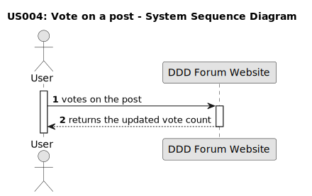
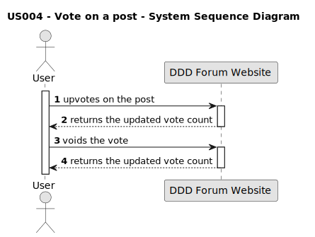
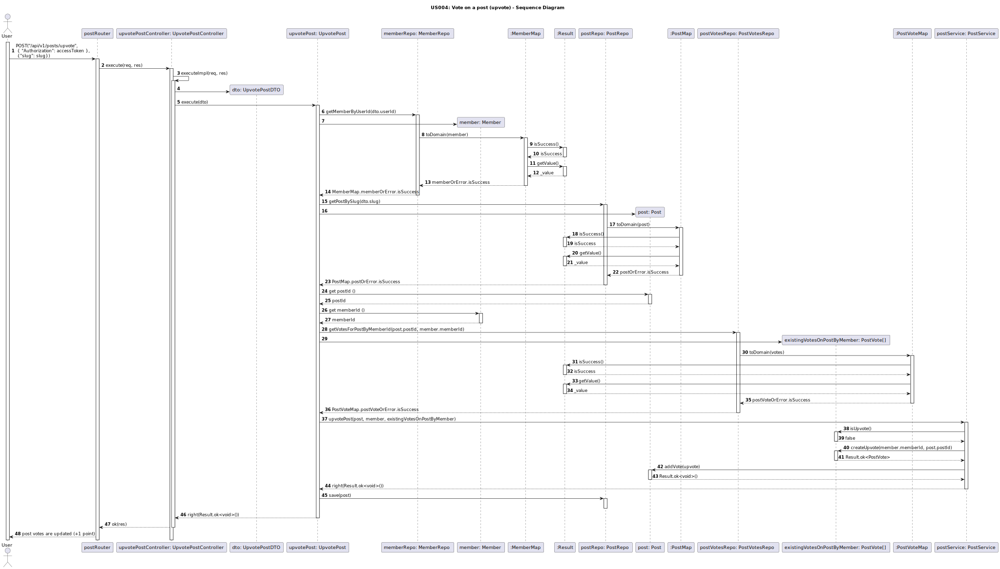

## US 004: Vote on a post

## 1. Requirements Engineering

### 1.1. User story description

As a user, I want to vote on the forum posts.

### 1.2. Customer Specifications and Clarifications

**From the specification document:**

> The ability to vote on a post is exclusive to the users of the forum. The user must have an account and be logged in.

**From the customer's clarifications:**

> **Question:**
> What is necessary to vote on a post?  
> **Answer:**
> The visitor must be a user of the DDD Forum website and be authenticated in order to vote on a post.

> **Question:**
> Which kind of votes can be applied to a post?
>
> **Answer:**
> The user can upvote, downvote or void the vote on a post.

> **Question:** How will the option to vote be displayed in the forum interface?
>
> **Answer:** The buttons are located to the left of the post, the visual design of the icons are up arrows, down arrows.

> **Question:**
> Who can see the votes applied to a post?
>
> **Answer:**
> All visitors can see the votes applied to a post.

> **Question:**
> Can the user void the vote on a post?
>
> **Answer:**
> Yes, the user can void the vote on a post.

### 1.3. Acceptance criteria

- **AC1:** The user must be authenticated to vote.
- **AC2:** The user must be able to upvote a post created by another user, increasing the counter by one.
- **AC3:** The user must be able to downvote a post created by another user, decreasing the counter by one.
- **AC4:** The user must be able to cancel a vote (upvote or downvote) on a post.
- **AC5:** The user must be able to revert the vote (from upvote to downvote and vice-versa).
- **AC6:** The user must not be able to upvote more than once on the same post.
- **AC7:** The user must not be able to downvote more than once on the same post.
- **AC8:** The user must not be able to vote on their own post.

### 1.4. Found out dependencies

- There is a dependency to "US 010: Perform a login" because the user needs to be authenticated and logged in to access the vote functionality.
- There is a dependency to existing a post, so that a vote on it can be possible.

### 1.5 Input and output data

**Input data:**

- Vote type: upvote or downvote

**Output data:**

- Vote count: updated count of votes for the post after the vote interaction

### 1.6. System Sequence Diagram (SSD)

#### Alternative One

#### Alternative Two

### 1.7 Other relevant observations

- The total count is made without the breakdown of the votes (upvotes and downvotes).
- The functionality is not working properly when a downvote is submitted, the counter is not always decreasing by one.
  The feature doesn't have always the same behavior.

### 1.8. Bugs

#### **Bug #1**: When the user who votes is not the post owner and upvotes a post that was never voted before, the counter increments 2 points. (AC2) (front-end and back-end)

##### **Description:**

When a user upvotes a post that was created by another user and that has never been voted before (initial points = 0), the counter increments 2 points instead of 1. On the following upvotes on that post, made by other users, the counter works as expected and increments 1 point after an upvote.

##### **Approach:**

Investigate and debug the code responsible for character counting.
Validations should be done in the back-end and the front-end.

#### **Bug #2**: When the user who votes is not the post owner and downvotes a post that was never voted before, the counter remains with 0 points. (AC3) (front-end and back-end)

##### **Description:**

When a user downvotes a post that was created by another user and that has never been voted before (initial points = 0), the counter does not change the number of points, remaining with 0 points. On the following downvotes on that post, made by other users, the counter works as expected and decrements 1 point after a downvote.

##### **Approach:**

Investigate and debug the code responsible for text formatting.
Validations should be done in the front-end.

#### **Bug #3**: When the user who votes is not the post owner and cancels the first vote on a post - upvote or downvote - the final points in the counter do not equal 0 (AC4) (front-end and back-end)

##### **Description:**

When a user upvotes a post that was created by another user and that has never been voted before (initial points = 0), when trying to cancel that vote (by downvoting) the counter does decrement 1 point, but the final points are 1 instead of 0 (might be related to bug #1).

When a user downvotes a post that was created by another user and that has never been voted before (initial points = 0), when trying to cancel that vote (by upvoting) the counter does increment 1 point, but the final points are 1 instead of 0 (might be related to bug #2).

##### **Approach:**

Investigate and debug the code responsible for text formatting.
Validations should be done in the front-end.

#### **Bug #4**: When the user who votes is not the post owner and reverts the first vote on a post - upvote or downvote - the final points in the counter are not correct (AC5) (front-end and back-end)

##### **Description:**

When a user upvotes a post that was created by another user and that has never been voted before (initial points = 0), when trying to revert it to downvote, besides the correct decrementation of 1 point in the second downvote, the final points are incorrect, being 0 instead of -1 (might be related to previous cascade of bug #1 --> bug #3).

When a user downvotes a post that was created by another user and that has never been voted before (initial points = 0), when trying to revert it to upvote, besides the correct incrementation of 1 point in the second upvote, the final points are incorrect, being 2 instead of 1 (might be related to previous cascade of bug #2 --> bug #3).

##### **Approach:**

Investigate and debug the code responsible for text formatting.
Validations should be done in the front-end.

#### **Bug #5**: Although a user (not post owner) can not upvote more than once on a post, the status response for the second upvote is "200 OK". (AC6) (back-end)

##### **Description:**

In the back-end, the status response is "200 OK" for the second upvote, although no second incrementation occurs.

##### **Approach:**

Investigate and debug the code responsible for text formatting.
Validations should be done in the front-end.

#### **Bug #6**: Although a user (not post owner) can not downvote more than once on a post, the status response for the second downvote is "200 OK". (AC7) (back-end)

##### **Description:**

In the back-end, the status response is "200 OK" for the second downvote, although no second decrementation occurs.

##### **Approach:**

Investigate and debug the code responsible for text formatting.
Validations should be done in the front-end.

#### **Bug #7**: The status response for an upvote/downvote on a post request made by the post owner is always "200 OK". (AC8) (back-end)

##### **Description:**

In terms of the final number of points, they do not change in both the front-end and the back-end. However, although the vote was not successful, the status returned in the back-end is always "200 OK".
In the front-end, right after the upvote/downvote, the counter shows an increment/decrement of 1 point, accordingly, that disappears after refreshing the homepage.

##### **Approach:**

Investigate and debug the code responsible for text formatting.
Validations should be done in the front-end.

#### **Bug #8**: A user can downvote his own post. (AC8) (front-end and back-end)

##### **Description:**

The user can downvote and decrement the counter in two situations:

- When the post created by the user has never been voted before and the user downvotes twice (initial points = 0; final points = -1);
- When the post created by the user has been voted by one or more users and the post owner downvotes once or twice (ex.: initial points = 2; final points = 1 or 0).

##### **Approach:**

Investigate and debug the code responsible for text formatting.
Validations should be done in the front-end.

##### **Summary:**

| Acceptance Criteria | Front-End | Back-End |
| -------- | -------- | -------- |
| AC1 | No bugs found.| Same behaviour as the front-end.|
| AC2 | When a user upvotes a post that was created by another user and that has never been voted before (initial points = 0), the counter increments 2 points instead of 1. On the following upvotes on that post, made by other users, the counter works as expected and increments 1 point after an upvote. NOTE: Initialy, on the homepage, the first upvote shows an increase of the counter by 1 point. Only after refreshing the homepage it is possible to see the increment of 2 points. **[Bug #1]** | Same behaviour as the front-end. NOTE: Sometimes, when a post is created, the counter initiates with 1 point instead of 0 (back-end and front-end). In that case, after the first upvote the counter increments 1 point, as expected.|
| AC3 | When a user downvotes a post that was created by another user and that has never been voted before (initial points = 0), the counter does not change the number of points, remaining with 0 points. On the following downvotes on that post, made by other users, the counter works as expected and decrements 1 point after a downvote. NOTE: Initialy, in the homepage, the first downvote shows a decrease of the counter by 1 point. Only after refreshing the homepage it is possible to see that the counter did not change. **[Bug #2]** | Same behaviour as the front-end. NOTE: Sometimes, when a post is created, the counter initiates with 1 point instead of 0 (back-end and front-end). In that case, after the first downvote the counter decrements 1 point, as expected. |
| AC4 | When a user upvotes a post that was created by another user and that has never been voted before (initial points = 0), when trying to cancel that vote (by downvoting) the counter does decrement 1 point, but the final points are 1 instead of 0 (might be related to bug #1). When in the same initial conditions a user tries to cancel the downvote (by upvoting), the counter does increment 1 point, but the final points are 1 instead of 0 (might be related to bug #2). NOTE: Only after refreshing the homepage it is possible to see the mentioned final scores. **[Bug #3]** | Same behaviour as front-end.|
| AC5 | When a user upvotes a post that was created by another user and that has never been voted before (initial points = 0), when trying to revert it to downvote, besides the correct decrementation of 1 point in the second downvote, the final points are incorrect, being 0 instead of -1 (might be related to previous cascade of bug #1 --> bug #3). When in the same initial conditions a user tries to revert the downvote to upvote, besides the correct incrementation of 1 point in the second upvote, the final points are incorrect, being 2 instead of 1 (might be related to previous cascade of bug #2 --> bug #3). NOTE: Only after refreshing the homepage it is possible to see the mentioned final scores. **[Bug #4]** | Same behaviour as front-end. NOTE: Both reversion from upvote to downvote and from downvote to upvote are possible (status "200 OK").|
| AC6 | No bugs found, besides real final points are only visible after refreshing the homepage (before that, by making the second upvote the counter decrements 1 point). **[Bug #5]** | Same behaviour as front-end. NOTE: When the second upvote request is made, the status returned is always "200 OK", instead of an error.|
| AC7 | No bugs found, besides real final points are only visible after refreshing the homepage (before that, by making the second downvote the counter increments 1 point). **[Bug #6]** | Same behaviour as front-end. NOTE: When the second downvote request is made, the status returned is always "200 OK", instead of an error.|
| AC8 | No bugs found, besides real final points are only visible after refreshing the homepage (before that, by making the upvote/downvote try the counter increments/decrements 1 point, accordingly). **[Bug #7]** | Same behaviour as front-end. But when the upvote/downvote request is made, the status returned is always "200 OK", instead of an error.|
| AC8 | The user can downvote and decrement the counter in two situations: (1) when the post created by the user has never been voted before and the user downvotes it twice (initial points = 0; final points = -1); (2) when the post created by the user has been voted by one or more users and the post owner downvotes once or twice (ex.: initial points = 2; final points = 1 or 0). **[Bug #8]** | Same behaviour as front-end.|

##### **Fixed bugs:**

**Bug #1:** When the user who votes is not the post owner and upvotes a post that was never voted before, the counter increments 2 points. (AC2) (front-end and back-end)

* **Back-end:** The problem was in the "Post" class from the backend (src/modules/forum/domain/post.ts), in the "creat" function. The "create" function was creating an upvote to the post from the user who created it. The problem was solved by removing that piece of code.

**Bug #2:** When the user who votes is not the post owner and downvotes a post that was never voted before, the counter remains with 0 points. (AC3) (front-end and back-end)

* **Back-end:** Solved after correction of bug #1.

**Bug #3:** When the user who votes is not the post owner and cancels the first vote on a post - upvote or downvote - the final points in the counter do not equal 0 (AC4) (front-end and back-end)

* **Back-end:** Solved after correction of bug #1. 

**Bug #4:** When the user who votes is not the post owner and reverts the first vote on a post - upvote or downvote - the final points in the counter are not correct (AC5) (front-end and back-end)

* **Back-end:** Solved after correction of bug #1.

**Bug #5:** Although a user (not post owner) can not upvote more than once on a post, the status response for the second upvote is "200 OK". (AC6) (back-end)

* **Back-end:** 

**Bug #6:** Although a user (not post owner) can not downvote more than once on a post, the status response for the second downvote is "200 OK". (AC7) (back-end)

* **Back-end:**

**Bug #7:** The status response for an upvote/downvote on a post request made by the post owner is always "200 OK". (AC8) (back-end) 

* **Back-end:**

**Bug #8:** A user can downvote his own post. (AC8) (front-end and back-end)

* **Back-end:** 

### 1.9. Sequence Diagram

