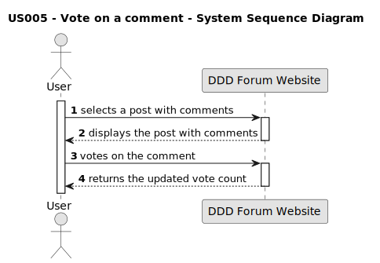
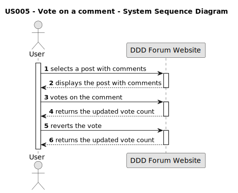

# US 005: Vote on a comment

## 1. Requirements Engineering

### 1.1. User Story Description

As a user, I want to vote on the comment posts.

### 1.2. Customer Specifications and Clarifications 

**From the specifications document:**

>	The ability to vote on a comment is exclusive to the users of the forum. The user must have an account and be logged in. 

**From the client clarifications:**

> **Question:** 
> What is necessary to vote on a comment?  
>
> **Answer:** 
> The visitor must be a user of the DDD Forum website and be authenticated in order to vote on a comment.

> **Question:** 
> Which kind of votes can be applied to a comment?
>
> **Answer:** 
> The user can upvote or downvote a comment.

> **Question:** 
> How will the option to vote be displayed in the forum interface?
>  
> **Answer:**  The buttons are located on the left side of the comment post. The visual design of the icons are up arrows, down arrows.
> 

> **Question:**
> Who can see the votes applied to a comment?
>
> **Answer:**
> All visitors can see the votes applied to a comment.

### 1.3. Acceptance Criteria

* **AC1:** The user must be authenticated to vote.
* **AC2:** The user must be able to upvote a comment created by another user, increasing the counter by one.
* **AC3:** The user must be able to downvote a comment created by another user, decreasing the counter by one.
* **AC4:** The user must be able to cancel a vote (upvote or downvote) on a comment.
* **AC5:** The user must be able to revert the vote (from upvote to downvote and vice-versa).
* **AC6:** The user must not be able to upvote more than once on the same comment.
* **AC7:** The user must not be able to downvote more than once on the same comment.

### 1.4. Found out Dependencies

* There is a dependency to "US 010: Perform a login" because the user needs to be authenticated and logged in to access the vote functionality.
* US005 depends on "US006: Comment on a post" because voting implies the existence of comments. To vote, there must be at least one comment present on a post.

### 1.5 Input and Output Data

**Input Data:**

* Vote type: upvote or downvote
  
**Output Data:**

* Vote count: updated count of votes for the comment after the vote interaction

### 1.6. System Sequence Diagram (SSD)

**Other alternatives might exist.**

#### Alternative One

#### Alternative Two

### 1.7 Other Relevant Remarks

* The total count is made without the breakdown of the votes (upvotes and downvotes).
* At the moment, the functionality to vote on comments in the DDD Forum Website is not working properly. The votes are not being recorded. 

### 1.8 Bugs

#### **Bug #1**: The user can´t vote on a comment. (AC2, AC3, AC4, AC5, AC6, AC7) (Front-end)
##### **Description:**

After the submission of the comment, the user can´t vote on the comment. The user can't upvote, downvote or revert the vote. 

##### **Approach:**

Investigate and debug the code responsible for character counting.
Validations should be done in the front-end.

##### **Summary:**

| Acceptance Criteria | Front-End | Back-End |
| -------- | -------- | -------- |
| AC1 | No bugs found | Same behaviour from frontend |
| AC2 | After the submission of the comment, the user can´t vote on the comment. **Bug #1**| No bugs found |
| AC3 | Same as AC2. **Bug #1** | No bugs found |
| AC4 | Same as AC2. **Bug #1** | No bugs found |
| AC5 | Same as AC2. **Bug #1** | No bugs found |
| AC6 | Same as AC2. **Bug #1** | No bugs found |
| AC7 | Same as AC2. **Bug #1** | No bugs found |
| AC8 | No bugs found | The comment begins with one upvote. **Bug #2** |

