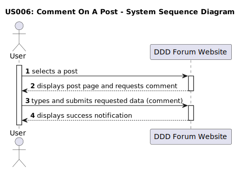
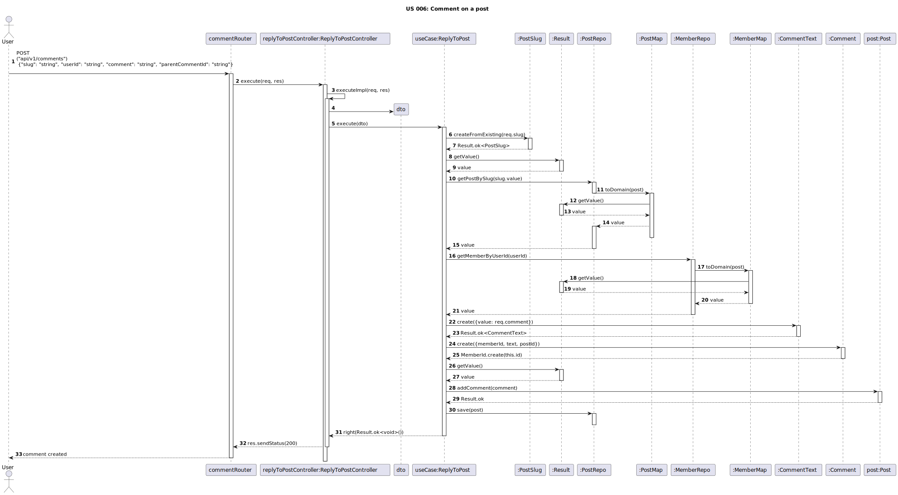

# US 006 - Comment on a post

## 1. Requirements Engineering

### 1.1. User Story Description

As a user, I want to be able to comment on posts.

### 1.2. Customer Specifications and Clarifications 

**From the specifications document:**

> The ability to comment on a post is exclusive to the users of the forum.

> The users must have an account and be logged in.

**From the client clarifications:**

> **Question:** 
> What is necessary to comment on a post?
>
> **Answer:** 
> The visitor must be a user of the DDD Forum website and be authenticated in order to comment on a post.

> **Question:** 
> How many comments can a post have?
>
> **Answer:** 
> A post can have an unlimited number of comments.

> **Question:**
> How will it be displayed in the forum interface that a post has comments?
>
> **Answer:**
> The number of comments will be displayed to the right of the post, in the format "X comments".

### 1.3. Acceptance Criteria

* **AC1**  The user must be authenticated to comment on a post.
* **AC2:** A comment must have between 20 and 10000 characters.
* **AC3:** Text formatting options must be available and accessible (bold, italic, underline, hyperlink and code formatting).
* **AC4:** When the submitted data is valid, a success notification must be displayed.
* **AC5:** When the submitted data is invalid, an insuccess notification must be displayed.
* **AC6:** The comment must have zero votes applied by default.

### 1.4. Found out Dependencies

* There is a dependency to "US010: Perform a login", since the user must be authenticated on the DDD Forum website in order to comment on a post. 
* There is a dependency to "US 008: View post", since the user must be able to access the post details in order to comment on it. 
* There is a dependency to existing a post, so that comment on it can be possible.

### 1.5 Input and Output Data

**Input Data:**

* Typed data:
	* comment. 
>
* Selected data:
	* text formatting.

**Output Data:**

* Successful comment post:
	* green pop-up notification: "Done-zo! (cowboyhatface)";
>
* Invalid comment post:
	* red pop-up notification: "Yeahhhhh, comments should be 20 to 10000 characters. Yours was "X". (cowboyhatface)".

### 1.6. System Sequence Diagram (SSD)

### 1.7. Other Relevant Remarks

* After successfully submitting the comment, it must become visible in the comments section of the post page.
* It is possible to post a comment with less than 20 characters (ex.: 19 characters) or more than 10000 characters (ex.: 10001 characters), although it shouldn't.
* The characters counting of the comment is not always right.
* Bold formatting option is not functional.

### 1.8. Bugs

#### **Bug #1**: Incorrect counting of characters. (AC2) (front-end and back-end)

##### **Description:**

The characters counting of the comment is not always right. It is possible to post a comment with less than 20 characters (front-end and back-end).
On the other hand, it is not possible to post a comment with 10 000 characters (front-end), although it should be possible.

##### **Approach:**

Investigate and debug the code responsible for character counting or length validation.
Validations should be done in the back-end and the front-end.

#### **Bug #2**: Code formatting affects the whole line. (AC3) (front-end)

##### **Description:**

The code formatting option applies to the entire comment, instead of just the selected text.

##### **Approach:**

Investigate and debug the code responsible for text formatting.
Validations should be done in the front-end.

#### **Bug #3**: Bold applied by default. (AC3) (front-end)

##### **Description:**

The comments, after being posted, are displayed in bold by default.

##### **Approach:**

Investigate and debug the code responsible for text formatting.
Validations should be done in the front-end.

#### **Bug #4**: Votes incorrectly applied on new comments (AC6) (back-end)

##### **Description:**

When a new comment is posted, it is displayed with 1 vote, instead of 0.

##### **Approach:**

Investigate and debug the code responsible for the submission of new comments.

##### **Summary:**

| Acceptance Criteria | Front-End | Back-End |
| -------- | -------- | -------- |
| AC1 | No bugs found | Same behaviour from frontend |
| AC2 | Comments with only 7 chars are accepted. Using exactly 10 000 chars gives an error telling the user that it is always above the maximum limit **[Bugs #1]** | Comments with only 2 chars are accepted. The maximum limit is working as intended **[Bugs #1]** |
| AC3 | Formatting words into code, applies to the whole line, instead of only the selected words. All comments are posted by default in bold **[Bugs #2, #3]**| It is possible to format specific words without affecting the whole line. Comments are also set in bold by default |
| AC4 | No bugs found | N/A |
| AC5 | No bugs found | N/A  |
| AC6 | The front-end displays the upvote applied on the back-end | An upvote is applied for new comments **[Bugs #4]** |

##### **Fixed bugs:**

* **Bug #1:** Incorrect counting of characters. (AC2) (front-end and back-end)

**Back-end:** The validation was set to 2 characters instead of 20. The validation was corrected.

[Link to the commit](https://github.com/Departamento-de-Engenharia-Informatica/switch-qa-23-project-switch-qa-23-4/commit/71ea8c7e2c5981431b719dd71c601fddf2e0f34e)

**Front-end:** After debug, it was found that the validation was being done in the back-end.
In the front-end the character counting of the comment text was taking into account the html tags, which were being counted as characters. The validation was corrected.

[Link to the commit](https://github.com/Departamento-de-Engenharia-Informatica/switch-qa-23-project-switch-qa-23-4/commit/b44481269e3b5acfc6466c4842817fd6698c6120)

* **Bug #3**: Bold applied by default. (AC3) (front-end)

There was a bold element being applied for the comment text.
The bold element was removed.

[Link to the commit](https://github.com/Departamento-de-Engenharia-Informatica/switch-qa-23-project-switch-qa-23-4/commit/f467d53a3a789a50d7ec1bc959e075d0922f9b7d)

* **Bug #4:** Votes incorrectly applied on new comments (AC6) (back-end)

There was code in the back-end applying an upvote to the comment when created.
The code was removed.

[Link to the commit](https://github.com/Departamento-de-Engenharia-Informatica/switch-qa-23-project-switch-qa-23-4/commit/3494dd8ebc1db41faca57b10f1f68b80d46b9024)

### 1.9. Sequence Diagram

