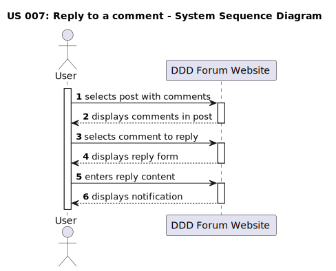

# US 007: Reply to a comment

## 1. Requirements Engineering

### 1.1. User Story Description

As a user, I want to be able to reply to a comment.

### 1.2. Customer Specifications and Clarifications

**From the specifications document:**

> The ability to reply to a comment is exclusive to the users of the forum.

> The users must have an account and be logged in.

**From the client clarifications:**

> **Question:**
> What is necessary to reply to a comment?
>
> **Answer:**
> The visitor must be a user of the DDD Forum website and be authenticated in order to reply to a comment.

> **Question:**
> How many replies can a comment have?
>
> **Answer:**
> A comment can have an unlimited number of replies.

> **Question:**
> How will it be displayed in the forum interface that a comment/reply has replies?
>
> **Answer:**
> The replies will be displayed to the bottom of the comment/reply in a hierarchical way.

### 1.3. Acceptance Criteria

- **AC1** The user must be authenticated to reply to a comment.
- **AC2:** A reply must have between 20 and 10000 characters.
- **AC3:** Text formatting options must be available and accessible (bold, italic, underline, hyperlink and code formatting).
- **AC4:** When the submitted data is valid, a success notification must be displayed.
- **AC5:** When the submitted data is invalid, an insuccess notification must be displayed.

### 1.4. Found out Dependencies

- There is a dependency to "US010: Perform a login", since the user must be authenticated and have access to their account on the DDD Forum website in order to comment on a post.
- There is a dependency to "US 008: View post", since the user must be able to access post details page in order to comment on it.
- There is a dependency to existing a comment to a post, so that reply to a comment can be possible

### 1.5 Input and Output Data

**Input Data:**

- Typed data:
  - a comment.
- Selected data:
  - text formatting.

**Output Data:**

- Successful reply:

  - green pop-up notification "Done-zo! (cowboyhatface)";

- Invalid reply:
  - red pop-up notification "Yeahhhhh, comments should be 20 to 10000 characters. Yours was "X". (cowboyhatface)".

### 1.6. System Sequence Diagram (SSD)

### 1.7 Other Relevant Remarks

- After successfully submitting the reply, it must become visible in the comments section of the post page.

### 1.8 Bugs

#### **Bug #1**: Incorrect counting of characters. (AC2) (front-end and back-end)

##### **Description:**

The characters counting of the comment is not always right. It is possible to post a comment with less than 20 characters (front-end and back-end).
On the other hand, it is not possible to post a comment with 10 000 characters (front-end).

##### **Approach:**

Investigate and debug the code responsible for character counting.
Validations should be done in the back-end and the front-end.

#### **Bug #2**: Code formatting affects the whole line. (AC3) (front-end)

##### **Description:**

The code formatting option applies to the entire comment, instead of just the selected text.

##### **Approach:**

Investigate and debug the code responsible for text formatting.
Validations should be done in the front-end.

#### **Bug #3**: Bold applied by default. (AC3) (front-end)

##### **Description:**

The comments, after being posted, are displayed in bold by default.

##### **Approach:**

Investigate and debug the code responsible for text formatting.
Validations should be done in the front-end.

##### **Summary:**

| Acceptance Criteria | Front-End                                                                                                                                                   | Back-End                                                                                                           |
| ------------------- | ----------------------------------------------------------------------------------------------------------------------------------------------------------- | ------------------------------------------------------------------------------------------------------------------ |
| AC1                 | No bugs found                                                                                                                                               | Same behaviour from frontend                                                                                       |
| AC2                 | Comments with only 7 chars are accepted. Using exactly 10 000 chars gives an error telling the user that it is always above the maximum limit **[Bugs #1]** | Comments with only 2 chars are accepted. The maximum limit is working as intended **[Bugs #1]**                    |
| AC3                 | Formatting words into code, applies to the whole line, instead of only the selected words. All comments are posted by default in bold **[Bugs #2, #3]**     | It is possible to format specific words without affecting the whole line. Comments are also set in bold by default |
| AC4                 | No bugs found                                                                                                                                               | N/A                                                                                                                |
| AC5                 | No bugs found                                                                                                                                               | N/A                                                                                                                |

##### **Fixed bugs:**

- **Bug #1:** Incorrect counting of characters. (AC2) (front-end and back-end)

**Back-end:** The validation was set to 2 characters instead of 20. The validation was corrected.

[Link to the commit] (https://github.com/Departamento-de-Engenharia-Informatica/switch-qa-23-project-switch-qa-23-4/commit/85f54e4afeec7e6e1a63f34eaa6b6579b391f57c)

**Front-end:** After debug, it was found that the validation was being done in the back-end.
In the front-end the character counting of the comment text was taking into account the html tags, which were being counted as characters. The validation was corrected.

[Link to the commit](https://github.com/Departamento-de-Engenharia-Informatica/switch-qa-23-project-switch-qa-23-4/commit/b44481269e3b5acfc6466c4842817fd6698c6120)

### 1.9. Sequence Diagram

