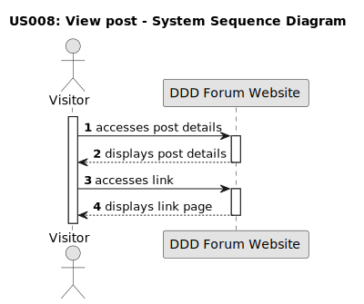

# US 008 - View post 

## 1. Requirements Engineering

### 1.1. User Story Description

As a visitor, I want to view the post details.

### 1.2. Customer Specifications and Clarifications 

**From the specifications document:**

> It is not required to be an authenticated user to view the posts details. 
>
> All visitors must acess the details of posts, comments and links, regardless of whether they are registered users or not.

**From the client clarifications:** 

> **Question:**
> How can the visitor access the details of a post?
>
> **Answer:**
> The visitor can access the details of a post by selecting the title or the link option.

> **Question:** 
> Are there any restrictions on who can access the details of a post?
>
> **Answer:**
> No, all visitors and users can access the details of a post.

### 1.3. Acceptance Criteria

* **AC1:** When selecting the post's title, the visitor must be redirected to the details.
* **AC2:** The visitor must be able to access the details of post's comments through "creation date".
* **AC3:** When selecting the link option on the details, the visitor must be redirected to the link's destination.

### 1.4. Found out Dependencies

* There is a dependency of existing a post, so that the visitor can access the details.

### 1.5 Input and Output Data

**Input Data:**

* Selected data:
	* post title (post)
	* link (post)
	* time from the creation date (comment)

**Output Data:** 

* Post
* Link page
* Comment

### 1.6. System Sequence Diagram (SSD)

**Other alternatives might exist.**

#### Alternative One 

* View text post details

#### Alternative Two

* View comment details

#### Alternative Three

* View Link Post
  

### 1.7 Other Relevant Remarks
	
* Visitors should have the ability to navigate back to the posts homepage or perform other actions related to the post from the details page.
* The post details should display: the post title enclosed in quotation marks, the number of votes, the post content or link, the  the post creation date, the post author, the post comments and the post tags.
* Creation date, can be displayed in hours, days, months or years, depending on the time elapsed since the post was created.
* Selecting the "Back to all discussions", in post details, the visitor is redirected to the forum website homepage.
* Visitors will also be able to access the comments details.
* Selecting the "Back to [post title]", in comment detals redirects the visitor to the details of the initially accessed post.
* If the link destination is unavailable or invalid, the visitor is redirected to a page similar to the details page, with the title "undefined".

