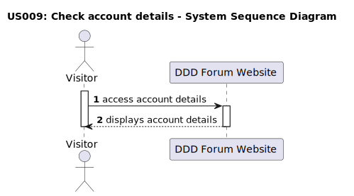

# US 009 - Check account details

## 1. Requirements Engineering

### 1.1. User Story Description

As a visitor, I want to view a specific user details and check the user with the most comments on the forum

### 1.2. Customer Specifications and Clarifications

**From the specifications document:**

> It is not required to be an authenticated user to check account details.
>
> All visitors must acess all account details, regardless of whether they are registered users or not.

**From the client clarifications:**

> **Question:**
> What specific information should be displayed on the account details page?
>
> **Answer:**
> The account details page is in development and should only show the username and the message: Nothing here just yet :p.

> **Question:**
> How should the account details be accessed?
>
> **Answer:**
> The account details should be accessible to all visitors, regardless of whether they are registered users or not. The account details should be accessible on the forum website interface, when the username is selected.

### 1.3. Acceptance Criteria

- **AC1:** The user does not need to be authenticated to see a user's profile page.
- **AC2:** The user must be able to access his own profile page, as well as the other users' profiles.
- **AC3:** The user profile page must display the account details of the selected user and details of the user with the most comments made in the forum.
- **AC4:** The account details of the selected user must be the username, email, number of posts and number of comments made by that user.
- **AC5:** The details of the user with the most comments made in the forum must be the username and the number of comments made by the respective user.
- **AC6:** The account details and user with most comments details must be up to date and reflect the current state of the forum.

### 1.4. Found out Dependencies

- There is a dependency of existing a post to have access to the user account details page.

### 1.5 Input and Output Data

**Input Data:**

- Selected data:
  - Username

**Output Data:**

- Account details page

### 1.6. System Sequence Diagram (SSD)

**Other alternatives might exist.**

#### Alternative One

### 1.7 Other Relevant Remarks

- The account details should be accessible to all visitors, regardless of whether they are registered users or not.
- The account details page is in development and should only show the username and the message: Nothing here just yet :p.
