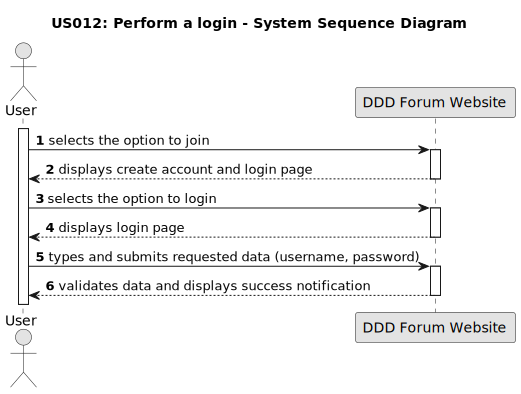

## US 010: Perform a login

## 1. Requirements Engineering

### 1.1. User Story Description

 
As a user, I want to authenticate so that I can use all the forum features.
 

### 1.2. Customer Specifications and Clarifications

**From the specifications document:**

> The system requires an user authentication to access part of the forum functionalities (e.g. create posts, create comments). It also allows users to log out of the forum website when desired.

**From the client clarifications:**

> **Question:** 
> What is necessary to perform a login?
>
> **Answer:**
> The visitor must be a user of the DDD Forum website and have an account in order to perform a login.

> **Question:** 
> Will the user need a second step to validate the login?
>
> **Answer:**
> No, the user will not need a second step to validate the login. The user will be directed to the homepage after the validation of the login.

> **Question:**
> What happens after a successful login?
>
> **Answer:**
> After a successful login, the user is redirected to the homepage of the forum website. The user is now authenticated and can access the features that require authentication.

> **Question:**
> What happens after an unsuccessful login?
>
> **Answer:**
> After an unsuccessful login, the user remains on the same page and a pop-up notification appears informing the user that the login was unsuccessful.

 
### 1.3. Acceptance Criteria

* **AC1**: All requested data (username and password) must be filled in.
* **AC2**: The entered username and password must match the information provided during the account creation process. 
* **AC3**: When the submitted data is invalid, a insuccess notification must be displayed.
* **AC4**: When the submitted data is valid, a success notification must be displayed.

### 1.4. Found out Dependencies

* There is a dependency to "US002: Create an account" because the user needs to be registered on the forum website in order to be able to login.

### 1.5 Input and Output Data

**Input Data:**

* Typed data:
    * an username,
    * a password

**Output Data:**

* Successful authentication:

Confirmation green pop-up notification "Logged in! (cowboyhatface)"

* Incorrect Input of the Username:

Username doesn't exist:

Output: Red pop-up notification "Had some trouble logging in! An unexpected error occurred. (cowboyhatface)"

Username is empty:

Output: "Yeahhhhh, you forgot to include username. (cowboyhatface)"

Username with less than 2 characters:

Output: Red pop-up notification "Had some trouble logging in! TypeError: Cannot read property 'toString' of undefined (cowboyhatface)"

* Incorrect Input of the Password 

Password doesn't exist:

Output: Red pop-up notification "Had some trouble logging in! Password doesnt match error. (cowboyhatface)"

Password is empty:

Output: "Yeahhhhh, you forgot to include your password. (cowboyhatface)"

Password with less than 6 characters:

Output: Red pop-up notification "Had some trouble logging in! TypeError: Cannot read property 'toString' of undefined (cowboyhatface)"

### 1.6. System Sequence Diagram (SSD)

### 1.7 Other Relevant Remarks

* The outputs of incorrect input of the username and password aren't always the same, depending on the input of valid data.

* This user story was important to document but was not included in the use case diagram. It is not a core feature of the forum website.