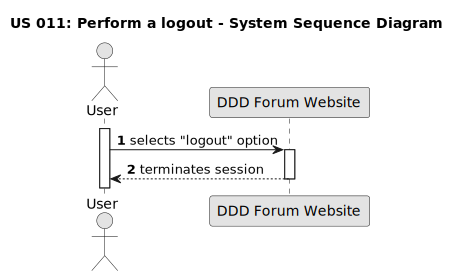

## US 011: Perform a logout

## 1. Requirements Engineering

 
### 1.1. User Story Description

As a user, I want to be able to logout of the forum website.

### 1.2. Customer Specifications and Clarifications

**From the specifications document:**

> The system requires an user authentication to access part of the forum functionalities.

**From the client clarifications:**

 

> **Question:** 
> What is necessary to perform a logout?
>
> **Answer:**
> The visitor must be a user authenticated in order to perform a logout.

> **Question:** 
>  How will the option to logout be displayed in the forum interface?
>
> **Answer:**
> The option to logout will be displayed in the user menu, which is located in the top right corner of the website's interface. The option will be displayed as a button with the text "logout".

> **Question:**
> Who can perform a logout?
>
> **Answer:**
> All users can perform a logout.
>

> **Question:**
> What happens after a successful logout?
>
> **Answer:**
> After a successful logout, the user is redirected to the same page they were on before the logout. The user is no longer authenticated and can no longer access the features that require authentication.

### 1.3. Acceptance Criteria

* **AC1:** Selecting the "logout" option must terminate the user session. 
* **AC2:** After a successful logout, the user must not have access to the features that require authentication.
* **AC3:** After a successful logout, a success notification must be displayed.

### 1.4. Found out Dependencies

* There is a dependency to "US002: Create an account", since the user needs to be registered on the forum website in order to be able to logout.
* There is a dependency on "US010: Perform a login" because the user needs to be logged in to the website before they can logout.
 
### 1.5 Input and Output Data

**Input Data:**

* Selected data: 
The user triggers the logout process by selecting the "logout" option.

**Output Data:**

* Successful logging out:
Confirmation green pop-up notification "Logged out! (cowboyhatface)"
* Attempt to comment after logging out:
Output: Red pop-up notifications "Yeahhhhh, (cowboyhatface)", "Yeahhhhh, Token signature expired. (cowboyhatface)"
* Attempt to vote after logging out:
Output: "Want to vote? You need to sign up Here"

 

### 1.6. System Sequence Diagram (SSD)

**Other alternatives might exist.**

### 1.7 Other Relevant Remarks

* The user is able to perform a logout from any page of the forum website.
* This user story was important to document but was not included in the use case diagram. It is not a core feature of the forum website. 
