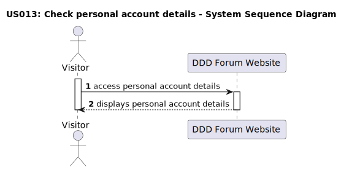

# US 013 - Check personal account details

## 1. Requirements Engineering

### 1.1. User Story Description

As a user, I want to view my personal account details.

### 1.2. Customer Specifications and Clarifications

**From the specifications document:**

> It is not required to be an authenticated user to check account details.
>
> All visitors must acess all account details, regardless of whether they are registered users or not.

**From the client clarifications:**

> **Question:**
> What specific information should be displayed on the account details page?
>
> **Answer:**
> The account details page is in development and should only show the username and the message: Nothing here just yet :p.

> **Question:**
> How should the account details be accessed?
>
> **Answer:**
> The account details should be accessible to all visitors, regardless of whether they are registered users or not. The account details should be accessible on the forum website interface, when the username is selected.

### 1.3. Acceptance Criteria

- **AC1:**
- **AC2:**
- **AC3:**
- **AC4:**
- **AC5:**
- **AC6:**

### 1.4. Found out Dependencies

-

### 1.5 Input and Output Data

**Input Data:**

- Selected data:
  - Username

**Output Data:**

- Account details page

### 1.6. System Sequence Diagram (SSD)

**Other alternatives might exist.**

#### Alternative One

### 1.7 Other Relevant Remarks
